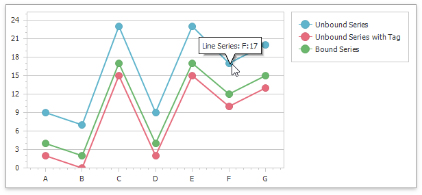
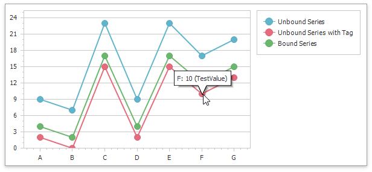

<!-- default file list -->
*Files to look at*:

* [Form1.cs](./CS/TooltipCustomization/Form1.cs) (VB: [Form1.vb](./VB/TooltipCustomization/Form1.vb))
<!-- default file list end -->
# How to show and customize chart tooltips

This example demonstrates how to enable and customize chart tooltips at runtime. 

To enable tooltips, set the [ChartControl.ToolTipEnabled](https://docs.devexpress.com/WindowsForms/DevExpress.XtraCharts.ChartControl.ToolTipEnabled) `true`. 

Specify the tooltip display text in the [ToolTipPointPattern](https://docs.devexpress.com/CoreLibraries/DevExpress.XtraCharts.SeriesBase.ToolTipPointPattern) property.

## Example Structure

The following example consists of tree series with the specified tooltip patterns:

*  `unboundSeries` - a simple unbound series.

   The series shows tooltips with the following pattern:

    `Line Series: {A}:{V}`

    

* `unboundSeriesWithTag` - an unbound series with the specified [SeriesPoint.Tag](https://docs.devexpress.com/CoreLibraries/DevExpress.XtraCharts.SeriesPoint.Tag) property for each data point.

    The series shows tooltips with the pattern that references the `Tag` values:

    `{A}: {V} ({Test})`

    

* `boundSeries` - a series that is bound to the data source.

    The series shows tooltips with the pattern that references the data source field values:

    `{A}: {V} ({Comment})`

    

## Documentation 

* [Chart Series](https://docs.devexpress.com/WindowsForms/6167/controls-and-libraries/chart-control/series?p=netframework)
* [Series Tooltip](https://docs.devexpress.com/WindowsForms/11977/controls-and-libraries/chart-control/end-user-features/tooltip-and-crosshair-cursor/tooltip)

